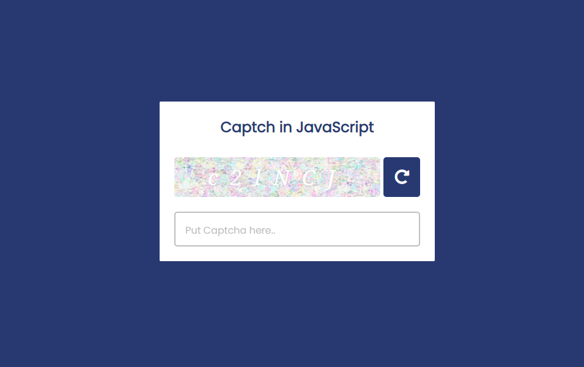

# Captcha match project in Vanilla JavaScript.

This is very simple projct in javaScript. This is simple catpcha matching application made by me. This application is very easy style and easy logic. If you have a hard logic and unique idea to see in my project please feel free to clone it do contributes what you want. Thanks

## Technologies Use
-- Vanilla JavaScript
-- HTML5/HTML
-- CSS3/CSS
-- SCSS
-- Google Fonts
-- Font Awesome
-- VS Code Editor
-- Git bash/ Github
-- Image( by google)
here is some tools which I need to make it...

### Demo Screenshot in my project 
;

> Thanks for reachout me on github 